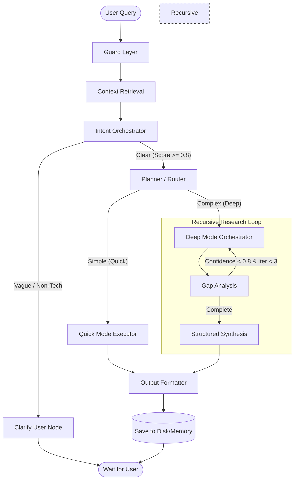

# 🔍 Developer Research AI Agent

[](https://www.python.org/downloads/)
[](https://github.com/langchain-ai/langgraph)
[](https://qdrant.tech/)
[](https://ollama.com/)
[](https://streamlit.io/)

A professional-grade, graph-based AI agent infrastructure designed for autonomous technical research. This agent leverages a sophisticated multi-stage pipeline to handle queries ranging from simple technical lookups to complex, iterative architectural analysis.

---

## 🚀 Key Features

*   **Dual-Mode Intelligent Routing**: Automatically distinguishes between "Quick Mode" (direct LLM synthesis) and "Deep Research Mode" (multi-step web search and gap analysis).
*   **Context-Aware Persistence**: Integrated with **Qdrant Vector Database** for long-term memory, allowing the agent to recall past interactions and build upon previous research.
*   **Adaptive Research Loop**: In Deep Mode, the agent performs iterative "Gap Analysis," refining its search queries until a specific confidence threshold is met.
*   **Streamlit Interactive Dashboard**: A premium UI featuring real-time token tracking, thread management, and a transparent view of the agent's "thinking" process (node execution path).
*   **Robust Guardrails**: Native telemetry for budgeting tokens and managing iteration depth to ensure cost-effective and timely responses.
*   **Human-in-the-Loop Clarification**: Automatically triggers a high-performance clarification flow via the **Intent Orchestrator** when query intent is ambiguous or non-technical.
*    **Graph Generation**: Automatically generates a visual representation of the research process and high-level architecture of technical systems, aiding in understanding and communication.

---

## 🏗️ System Architecture

The agent is built on **LangGraph**, treating the research process as a stateful directed acyclic graph (DAG).



### Technical Deep Dive
1.  **Guard Layer**: Initializes query-specific UUIDs and sets initial budget constraints.
2.  **Context Retrieval**: Performs a vector search in Qdrant to pull relevant history.
3.  **Intent Orchestrator**: Evaluates query integrity, assigns a confidence score, and determines if clarification is needed in a single, unified step.
4.  **Planner**: A meta-cognition step where the LLM decides the optimal execution path.
5.  **Gap Analysis**: Critically evaluates gathered data against the original objective, identifying missing information.

---

## 🛠️ Tech Stack

*   **Framework**: LangGraph / LangChain
*   **LLM Inference**: Ollama (Local)
*   **Vector Database**: Qdrant (Local)
*   **Search Infrastructure**: Tavily API (Primary) / DuckDuckGo (Fallback)
*   **UI/UX**: Streamlit
*   **Dependency Management**: `pip` or `uv`

---

## 📦 Installation & Setup

### Prerequisites
*   [Ollama](https://ollama.com/) installed and running.
*   Pull the required model: `ollama pull ministral-3:3b-cloud` (or configure in `config.py`).

### Standard Installation (pip)
```bash
# Create and activate environment
python -m venv .venv
source .venv/bin/activate  # Windows: .venv\Scripts\activate

# Install dependencies
pip install -r requirements.txt
```

### Modern Installation (uv)
```bash
# Direct run via uv
uv run streamlit run app.py
```

### Environment Configuration
Create a `.env` file in the root directory:
```env
TAVILY_API_KEY=your_tavily_api_key_here  # Optional, but recommended
```

---

## 🏃 Usage

### Interactive Web Dashboard (Recommended)
Launch the Streamlit UI for a premium, interactive experience:
```bash
streamlit run app.py
```

### CLI Mode
For developers who prefer the terminal:
```bash
python main.py
```

---

## 📂 Project Structure

```text
.
├── app.py                  # Main Streamlit UI Entry Point
├── main.py                 # CLI Entry Point & Graph Orchestrator
├── config.py               # Global Settings (Models, Thresholds, Paths)
├── state.py                # LangGraph Type Definitions
├── persistence.py          # SQLite Checkpointer for Graph State
├── memory.py               # Qdrant Vector DB Integration Logic
├── graph/                  # Core Agent Logic
│   ├── nodes_pre.py        # Guard, Context, & Intent Analysis
│   ├── nodes_exec.py       # Dual-Mode Routers & Research Engines
│   ├── nodes_post.py       # Synthesis & Output Formatting
│   └── routes.py           # Conditional Logic for Graph Edges
├── prompts/                # Specialized LLM Prompt Templates
├── output/                 # Generated Markdown Research Reports
└── tests/                  # Automated Verification Suite
```

---

## ⚙️ Advanced Configuration

Modify `config.py` to tune the agent's behavior:
*   `MAX_ITERATIONS_DEEP_MODE`: Default `3`. Increase for deeper investigation.
*   `CONFIDENCE_THRESHOLD`: Default `0.8`. Adjust to change the research "stopping point."
*   `MODEL_NAME`: Swap between local Ollama models.

---

## 🤝 Contributing

Contributions are welcome! Please ensure you run the test suite before submitting PRs:
```bash
python test_research_agent.py
```

---

## 📄 License

This project is licensed under the MIT License - see the LICENSE file for details.

