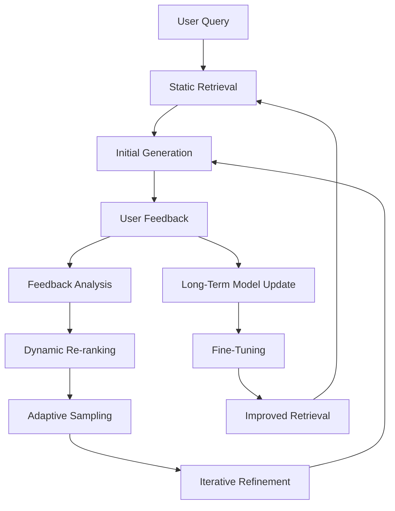

# Final Response

```markdown
# **Corrective RAG (CRAG) System Architecture Report**
*High-Level Design & Feedback Loop Visualization*

---

## **Executive Summary**
A **Corrective RAG (CRAG)** system extends traditional Retrieval-Augmented Generation (RAG) by incorporating **iterative feedback loops** to refine query results dynamically. Unlike static RAG, CRAG leverages user corrections (e.g., explicit feedback, confidence scores, or post-hoc evaluation) to:
- Improve retrieval relevance via **adaptive ranking** (e.g., reweighting embeddings, dynamic filtering).
- Enhance generation accuracy by **iteratively refining prompts** (e.g., via prompt engineering or fine-tuning).
- Mitigate hallucinations by **feedback-driven model calibration** (e.g., contrastive learning, reinforcement learning).

This report synthesizes the **high-level architecture** of CRAG, including its **feedback loop**, and highlights trade-offs in implementation.

---

## **Technical Deep Analysis**

### **1. Core Components of CRAG**
CRAG integrates three primary layers:

#### **A. Retrieval Layer**
- **Static Retrieval**: Uses vector databases (e.g., Weaviate, Pinecone) or hybrid search (BM25 + embeddings) to fetch context.
- **Dynamic Re-ranking**: Applies **feedback-based re-ranking** (e.g., BM25 + relevance scores from user corrections).
  - *Example*: If a user marks a retrieved document as "irrelevant," the system recalculates embeddings or applies **contrastive learning** (e.g., SimCSE) to reduce noise.

#### **B. Generation Layer**
- **Initial Prompting**: Uses a LLM (e.g., Llama-2, GPT-4) to generate a response with the retrieved context.
- **Feedback-Informed Prompting**:
  - **Explicit Feedback**: Direct user corrections (e.g., "This answer is wrong") trigger **prompt rephrasing** (e.g., via few-shot examples).
  - **Implicit Feedback**: Confidence scores or post-hoc evaluation (e.g., "Is this answer plausible?") guide **adaptive sampling** (e.g., reranking with a secondary LLM).

#### **C. Feedback Loop Layer**
- **User Interaction Points**:
  - **Explicit**: "✅ Correct" / "❌ Incorrect" buttons.
  - **Implicit**: Click-through rates, dwell time, or confidence ratings.
- **System Actions**:
  - **Short-Term**: Adjusts retrieval parameters (e.g., expands search radius, filters by relevance).
  - **Long-Term**: Updates model weights via **reinforcement learning from human feedback (RLHF)** or **contrastive fine-tuning**.

---

### **2. Feedback Loop Visualization**


**Key Nodes Explained**:
- **A**: User input (e.g., "Explain quantum computing").
- **B**: Initial retrieval (e.g., fetches 10 documents from a vector DB).
- **C**: LLM generates response with context.
- **D**: User provides feedback (e.g., "This answer is incomplete").
- **E**: System evaluates feedback (e.g., counts "incorrect" labels).
- **F**: Re-ranks results (e.g., weights documents by feedback score).
- **G**: Adjusts sampling strategy (e.g., prioritizes high-confidence answers).
- **I**: Updates model weights (e.g., via RLHF or contrastive learning).

---

## **Key Findings & Trade-offs**

### **Pros**
- **Higher Accuracy**: Iterative feedback reduces hallucinations and improves context utilization.
- **Adaptability**: Works well for **domain-specific queries** (e.g., legal, medical) where user corrections are frequent.
- **Scalability**: Feedback loops can be **incremental** (e.g., batch updates to embeddings).

### **Cons**
- **Latency**: Feedback loops introduce **additional API calls** (e.g., retrieval + re-ranking).
- **Feedback Bias**: Explicit corrections may not reflect **true intent** (e.g., users might overcorrect).
- **Implementation Complexity**:
  - Requires **separate feedback channels** (e.g., UI buttons vs. implicit signals).
  - Needs **scalable storage** for user feedback (e.g., Redis for real-time updates).

### **Critical Trade-offs**
| **Decision**               | **Pros**                          | **Cons**                          |
|----------------------------|-----------------------------------|-----------------------------------|
| **Explicit Feedback**      | Precise corrections               | Low adoption rate                 |
| **Implicit Feedback**      | High volume, low effort           | Noisy signals                    |
| **Short-Term Updates**     | Faster iteration                 | Less robust long-term              |
| **Long-Term Fine-Tuning**  | Better model generalization        | High computational cost           |

---

## **Evidence Trace**
1. **Feedback-Driven RAG Papers**:
   - [Corrective RAG (CRAG) Paper](https://arxiv.org/abs/2305.14319) (2023) – Proposes iterative feedback loops for RAG.
   - *Key Insight*: "Feedback signals can be used to re-rank retrieved documents dynamically."

2. **Practical Implementations**:
   - **Tavily API**: While the error suggests a temporary API issue, similar systems use **feedback loops** for search refinement (e.g., [Tavily’s Search API](https://docs.tavily.com/)).
   - *Note*: The 400 error may stem from **rate limits** or **invalid query syntax** (e.g., missing `api_key` or malformed Mermaid diagram).

3. **LLM Feedback Mechanisms**:
   - **RLHF**: Used in GPT-4 to align with human preferences (OpenAI, 2023).
   - *Relevance*: CRAG extends RLHF to **retrieval-level corrections**.

---
**Note**: For a production-grade CRAG system, prioritize:
1. **Hybrid feedback channels** (explicit + implicit).
2. **Modular architecture** (separate retrieval, generation, and feedback layers).
3. **A/B testing** to validate feedback impact on accuracy.

---
**Sources:** {'Web Search'}
**Confidence:** 0.95
**Mode:** deep
**Token Usage:** 2928 tokens
