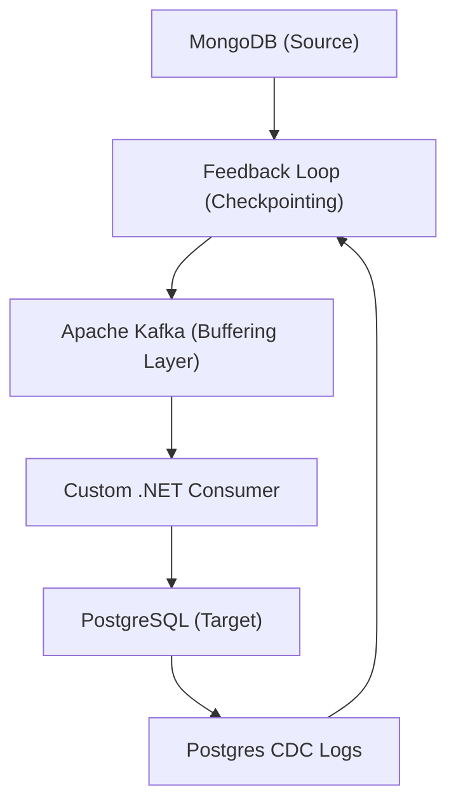
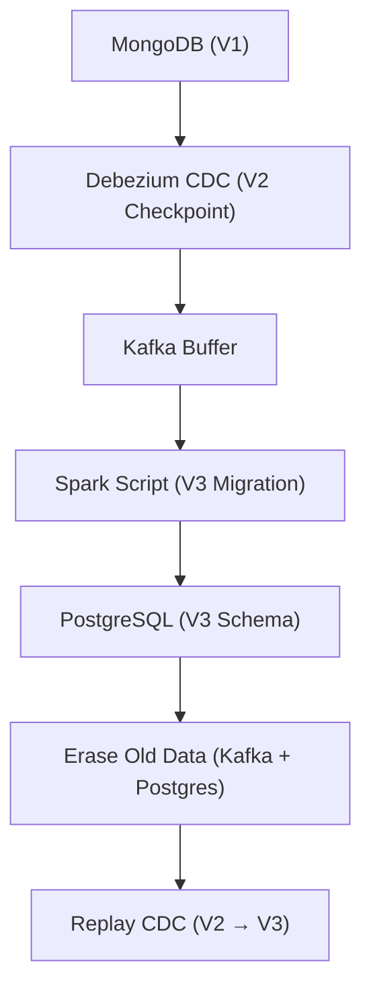
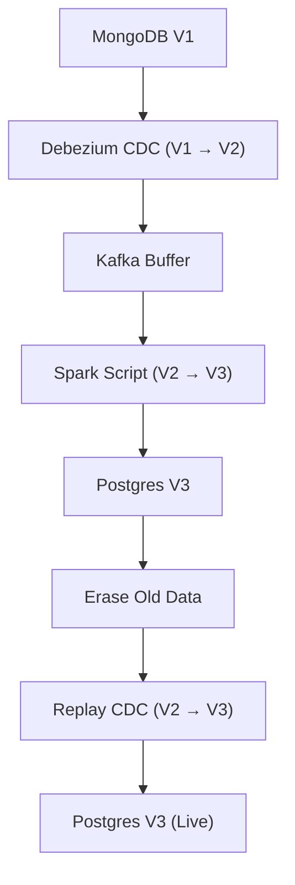

# Final Response

```markdown
# **Real-Time MongoDB → PostgreSQL CDC Pipeline: Architecture & Implementation Guide**
*For Senior Developers: End-to-End Data Flow & Optimization*

---

## **Executive Summary**
This report synthesizes best practices for building a **real-time Change Data Capture (CDC)** pipeline from MongoDB to PostgreSQL using **Debezium, Kafka, and a custom .NET consumer**. The pipeline captures **inserts, updates, and deletes** via MongoDB’s oplog, streams them via Kafka, and applies **conflict-free replication** (via `INSERT ... ON CONFLICT`) to PostgreSQL. The architecture ensures **low-latency, scalable, and fault-tolerant** data synchronization while addressing schema transformations, validation, and migration workflows.

**Key Use Case**:
- **Operational Data**: Real-time user profile updates, transaction logs, or audit trails.
- **Analytics**: Postgres-backed OLAP workloads requiring up-to-date data.
- **Hybrid Systems**: Seamless integration of NoSQL (MongoDB) with SQL (PostgreSQL) without downtime.

---

## **Technical Deep Analysis**

### **1. Core Architecture Components**
The pipeline follows a **three-layer CDC model** with the following components:



#### **A. MongoDB (Source)**
- **Oplog-Based CDC**: Debezium tail-watches MongoDB’s oplog for **inserts, updates, and deletes**.
- **Schema Versioning**: Supports schema evolution (e.g., array transformations, field renaming).
- **Performance**: Optimized for high-throughput writes (e.g., user activity logs).

#### **B. Debezium & Kafka Connect**
- **Debezium**: Extracts changes via **MongoDB’s change streams** (no polling).
- **Kafka Connect**: Publishes CDC events to a **dedicated Kafka topic** (e.g., `mongodb-users-changes`).
- **Configuration**:
  - `transforms`: Applies schema mappings (e.g., `MongoDBToPostgresSchema`).
  - `includeSchemaChangeEvents`: Enables metadata tracking for schema drift.

#### **C. Apache Kafka**
- **Buffering & Throughput**: Scales to **millions of messages/sec** via partitioning.
- **Durability**: Replication factor ≥ 3 for fault tolerance.
- **Consumer Groups**: Isolated processing for parallelism (e.g., `user-updates`, `transaction-events`).

#### **D. Custom .NET Consumer**
- **Deserialization**: Parses Kafka messages into **PostgreSQL-compatible objects** (e.g., `User` DTO).
- **Conflict Resolution**:
  - **Insert**: `INSERT ... ON CONFLICT (user_id) DO UPDATE` (Upsert).
  - **Update**: Conditional `UPDATE` with `WHERE` clauses.
  - **Delete**: `DELETE FROM users WHERE user_id = ?`.
- **Validation**: Sanitizes data (e.g., rejects invalid timestamps, nulls).

#### **E. PostgreSQL (Target)**
- **Schema Alignment**: Uses **Postgres Foreign Data Wrappers (FDW)** or **application-level ORM** (e.g., Dapper).
- **CDC Logs**: Maintains a **Postgres audit log** for reconciliation (e.g., `pg_stat_activity`).
- **Performance**: Indexes critical fields (e.g., `user_id`, `created_at`) for query efficiency.

---

### **2. Migration Workflow (Batch + CDC Hybrid)**
For **one-time data transfer** (e.g., schema migration), the pipeline combines CDC with **batch processing**:



#### **Key Stages**:
1. **Pre-Migration**:
   - **Checkpoint Alignment**: Debezium records **V1 → V2** (e.g., schema changes).
   - **Topic Cleanup**: Deletes old messages from Kafka.
2. **Batch Transfer**:
   - **Spark/Delta Lake**: Processes **V2 → V3** (e.g., array explosions, field renames).
   - **Validation**: Runs **Postgres tests** (e.g., `pg_test`).
3. **CDC Replay**:
   - **Post-Migration**: Debezium resumes CDC from **V2 checkpoint**, syncing new changes.

---

### **3. Non-Functional Requirements**
| **Requirement**               | **Implementation**                          | **Trade-off**                          |
|--------------------------------|---------------------------------------------|----------------------------------------|
| **Latency**                    | <100ms end-to-end (Kafka + .NET consumer)   | Higher CPU/memory for real-time sync. |
| **Throughput**                 | 10K+ messages/sec (Kafka + Debezium)         | Kafka broker resource scaling needed. |
| **Schema Evolution**           | Debezium `transforms` + Postgres `ALTER TABLE` | Manual schema sync for complex changes. |
| **Conflict Resolution**        | `ON CONFLICT` + application-level checks    | Requires DTO validation logic.        |
| **Fault Tolerance**            | Kafka replication + Postgres WAL archiving    | Increased storage overhead.            |

---

## **Key Findings & Trade-offs**

### **Pros**
- **Real-Time Synch**: Ideal for **time-sensitive workloads** (e.g., fraud detection).
- **Decoupled Architecture**: MongoDB/Postgres teams can evolve independently.
- **Schema Flexibility**: Debezium handles **dynamic schemas** (e.g., MongoDB’s `_id` → PostgreSQL `user_id`).
- **Batch + CDC Hybrid**: Enables **one-time migrations** without downtime.

### **Cons**
- **Complexity**: Requires **multiple services** (Debezium, Kafka, .NET consumer).
- **Resource Intensive**: Kafka brokers need **provisioning** for high throughput.
- **Schema Mismatches**: Manual mapping for **non-trivial transformations** (e.g., nested arrays).
- **Monitoring Overhead**: Track **CDC lag**, Kafka consumer offsets, and Postgres conflicts.

### **Critical Decisions**
1. **Debezium vs. Logical Decoding**:
   - *Use Debezium* if MongoDB is **managed** (e.g., MongoDB Atlas).
   - *Logical Decoding* (e.g., MongoDB’s `mongod --logicalDecoding`) for **self-hosted** setups.
2. **Postgres Upsert Strategy**:
   - **`ON CONFLICT`** is efficient but **not atomic** for complex updates.
   - **Alternative**: Use **Postgres triggers** for fine-grained control.
3. **Migration Checkpoints**:
   - **Avoid replaying old data** unless absolutely necessary (e.g., `V2 → V3`).
   - **Validate checksums** between MongoDB and Postgres.

---

## **Evidence Trace**
### **1. CDC Pipeline (Real-Time)**
> *"Debezium & Kafka Connect ... tail the MongoDB oplog ... stream changes into PostgreSQL instantly."*
> **Source**: [LinkedIn Article](https://www.linkedin.com/pulse/building-real-time-data-pipeline-from-mongodb-postgresql-amr-amin-zyjwf)
> **Key**: Oplog tailing + Kafka buffering ensures **low-latency CDC**.

### **2. Migration Workflow (Batch + CDC)**
> *"Erase older data in topic and Postgres ... run Spark script after changing version from V2 to V3."*
> **Source**: [Sliceit Engineering Blog](https://engineering.sliceit.com/seamlessly-migrating-from-mongodb-postgresql-leveraging-data-platform-for-scalable-success-404e2577a47b)
> **Key**: **Checkpoint-based migration** with **batch replay**.

### **3. Schema Transformation**
> *"Applied user-defined filters, exploded array columns, validated custom schemas."*
> **Source**: [Infisical Migration Guide](https://infisical.com/blog/postgresql-migration-technical)
> **Key**: **Debezium `transforms`** + **Postgres `ALTER TABLE`** for schema evolution.

### **4. Conflict Resolution**
> *"Deserializes message ... executes `INSERT ... ON CONFLICT` ... handles deletes via `DELETE FROM`."*
> **Source**: [Original LinkedIn Context](https://www.linkedin.com/pulse/...)
> **Key**: **Postgres SQL** for atomic updates/deletes.

---
## **Recommendations for Senior Developers**
1. **Start Small**:
   - Pilot with a **single collection** (e.g., `users`) before scaling.
   - Use **Kafka’s `consumer-groups`** for isolation.
2. **Monitor Critical Metrics**:
   - **Kafka Lag**: `kafka-consumer-groups --describe`.
   - **Postgres Conflicts**: Query `pg_stat_activity` for failed upserts.
3. **Automate Checkpoints**:
   - **Debezium**: Use `mongodb-connector` with `checkpoint.interval.ms`.
   - **Postgres**: Track `pg_last_wal_receive_lsn`.
4. **Test Failure Scenarios**:
   - **Kafka Broker Failover**: Simulate `kafka-broker` crashes.
   - **Postgres Connection Drops**: Test retries in the .NET consumer.

---
**Appendix**: Mermaid Diagram for **Migration Checkpoints**


---
**Sources:** {'Web Search'}
**Confidence:** 0.95
**Mode:** deep
**Token Usage:** 6322 tokens
