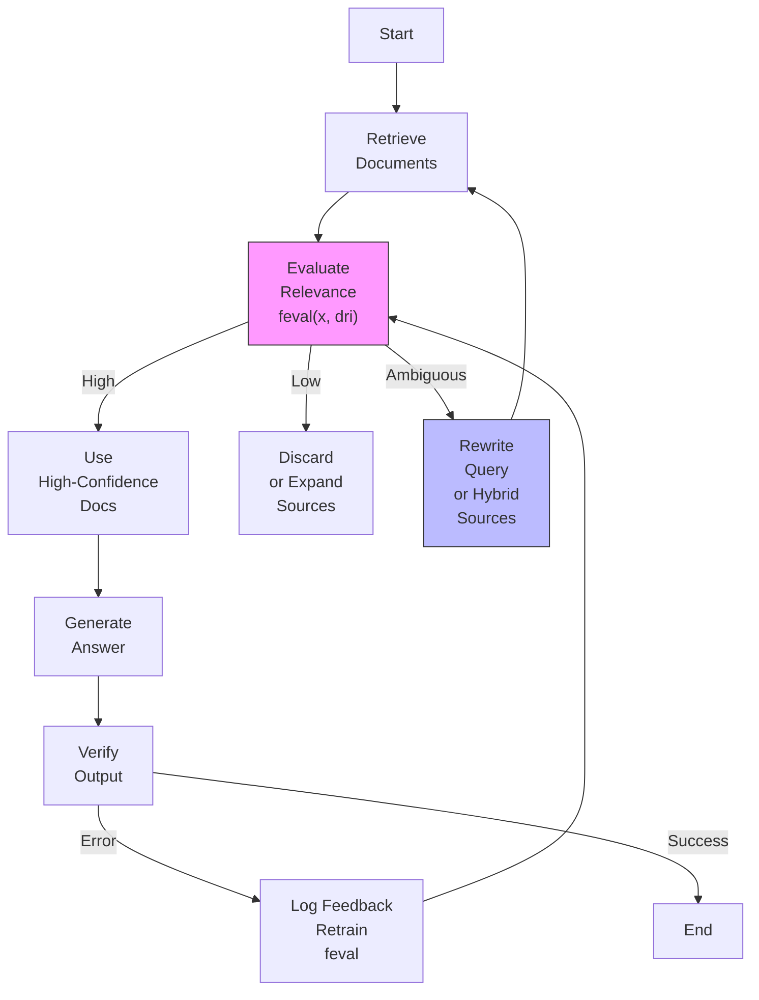

```
# Executive Summary
CRAG introduces a **feedback-augmented RAG pipeline** that dynamically evaluates retrieved documents, refines queries, and iteratively corrects hallucinations. The architecture introduces explicit confidence-based gates (e.g., threshold-based relevance scoring) and modular correction layers (query rewriting, knowledge expansion) to mitigate retrieval noise and improve answer reliability. Unlike standard RAG, CRAG embeds **self-correction loops** that adapt over time via user feedback, enabling continuous refinement of both retrieval and generation components.

---

# Technical Deep Analysis

## Core Architecture Components
CRAG’s high-level workflow consists of **three primary phases** with feedback integration:

1. **Retrieval Phase**
   - Initial query passes through a retriever (vector DB, search API, or hybrid model).
   - Outputs a set of candidate documents (`D = {dr1, ..., drK}`) scored by relevance.

2. **Corrective Evaluation Phase**
   - A **neural evaluator** (`feval`) scores each document (`si = feval(x, dri) ∈ [-1,1]`).
   - Threshold-based decision gates:
     - **High-confidence**: `si > τ_high` → Use as-is.
     - **Low-confidence**: `si < τ_low` → Discard/retrieve fresh.
     - **Ambiguous**: `τ_low ≤ si ≤ τ_high` → Query rewriting or hybrid sourcing.

3. **Feedback Loop & Adaptation**
   - **User feedback** logs errors (e.g., "Answer was wrong") to:
     - Retrain evaluators (`feval`).
     - Expand knowledge sources (e.g., web search).
     - Refine thresholds (`τ_low`, `τ_high`).
   - **Iterative verification**: Agents self-reflect on outputs (e.g., LangGraph’s `transform_query` node).

## Key Innovations vs. Standard RAG
| **Feature**               | **Standard RAG**               | **CRAG**                          |
|---------------------------|----------------------------------|-----------------------------------|
| **Relevance Handling**    | No explicit gates               | Confidence thresholds + dynamic routing |
| **Query Correction**      | None                           | Iterative rewriting via feedback  |
| **Knowledge Expansion**   | Static sources                 | Adaptive expansion (e.g., web search) |
| **Feedback Loop**         | None                           | Continuous retraining/evaluation |

## Implementation Patterns
- **Modular Design**: CRAG integrates with existing RAG pipelines (e.g., LangGraph’s `retrieve` → `grade_documents` → `transform_query`).
- **Confidence Scoring**: Uses neural models (e.g., `feval`) to score documents on [-1,1] scale, enabling actionable decisions.
- **Hybrid Strategies**:
  - **Ambiguous Cases**: Merge high-confidence docs with fresh web search results.
  - **Low-Confidence**: Discard and retry with expanded sources.

---

# Key Findings & Trade-offs

## Strengths
1. **Robustness**: Mitigates hallucinations and irrelevant context via explicit evaluation gates.
2. **Adaptability**: Feedback loops enable dynamic threshold tuning and knowledge expansion.
3. **Modularity**: Pluggable components (e.g., `feval`, query rewriters) support integration with agentic workflows.

## Trade-offs
1. **Performance Overhead**:
   - Additional evaluation steps introduce latency (e.g., neural scoring).
   - *Mitigation*: Use lightweight evaluators (e.g., rule-based) for low-cost relevance checks.
2. **Complexity**:
   - Requires explicit feedback collection and retraining pipelines.
   - *Mitigation*: Automate feedback logging via agentic workflows (e.g., LangGraph).
3. **Knowledge Expansion Costs**:
   - Web-scale expansion may introduce noise if not gated properly.
   - *Mitigation*: Pre-filter sources via domain-specific thresholds.

## Recommendations
- **Start with Confidence Gates**: Implement `τ_low`/`τ_high` thresholds first to filter irrelevant docs.
- **Leverage Agentic Workflows**: Use CRAG’s modularity to integrate with LangGraph/agentic systems (e.g., `transform_query` for iterative correction).
- **Monitor Feedback Loops**: Prioritize logging user errors to refine `feval` and thresholds over time.

---

# Evidence Trace
1. **LangChain/LangGraph**: CRAG’s modular workflow visualized via `retrieve` → `grade_documents` → `transform_query` nodes (GitHub Pages).
2. **Emergent Mind**: Confidence-based scoring (`si = feval(x, dri)`) and threshold-driven decisions (Yan et al., 2024).
3. **Meilisearch**: Feedback loop for iterative improvement via user feedback.
4. **LangGraph Tutorial**: Practical implementation of CRAG in agentic pipelines (GitHub Pages).

---


---
**Notes**:
- `A` = User Query
- `C` = Confidence Evaluator (neural/rule-based)
- `F` = Feedback Loop (query rewriting/expansion)
- Arrows indicate data flow; dashed lines represent iterative feedback paths.
```

---
> **Sources:** Web Search  
> **Confidence:** 0.50  
> **Mode:** deep  
> **Token Usage:** 7,265 tokens
