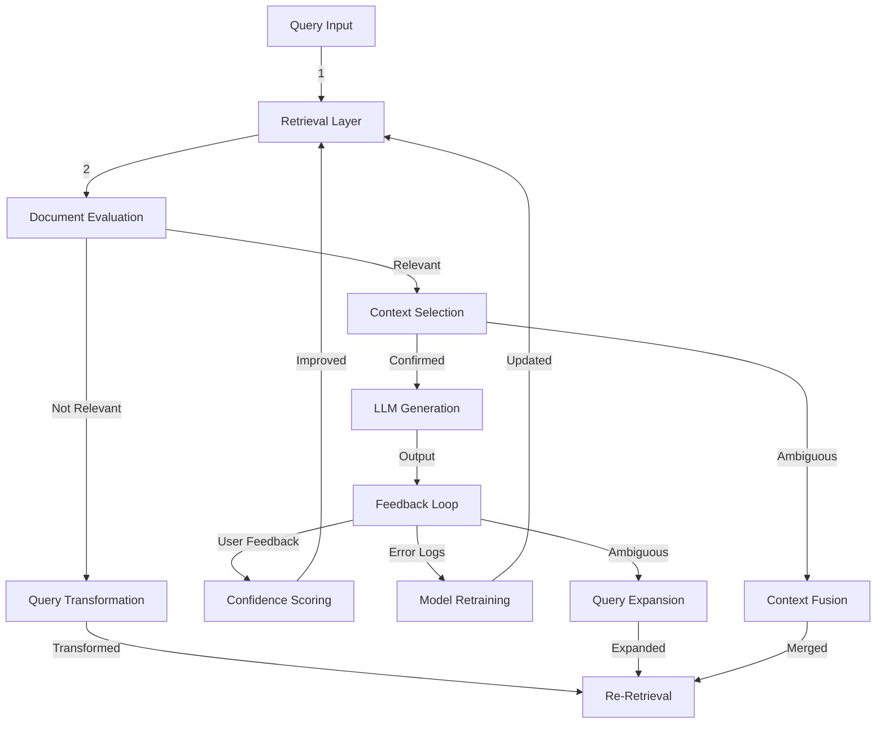

---

# Executive Summary
Corrective RAG (CRAG) enhances standard RAG pipelines by embedding a **feedback-driven evaluation layer** that dynamically filters, refines, or transforms inputs to mitigate hallucinations, irrelevant context, and retrieval noise. The architecture introduces modular stages—retrieval evaluation, query transformation, and iterative correction—where decisions are data-driven via confidence thresholds and user feedback loops. CRAG’s core strength lies in its **three-way decision framework** (correct, discard, or expand) and **self-improving feedback loop**, enabling continuous model refinement.

---

# Technical Deep Analysis

## Core Architecture Components
CRAG’s high-level workflow consists of **five interdependent stages**:

1. **Retrieval Layer**
   - Initializes with a query (A → B) and retrieves candidate documents (D = {dr₁, ..., drₖ}).
   - Sources: [Emergent Mind](https://www.emergentmind.com/topics/corrective-retrieval-augmented-generation-crag) | [LangChain Tutorial](https://langchain-ai.github.io/langgraph/tutorials/rag/langgraph_crag/).

2. **Document Evaluation**
   - Applies a **neural evaluator** (feval) to score each document’s relevance (sᵢ ∈ [-1,1]) relative to the query.
   - Uses **thresholds (τ_low, τ_high)** to classify documents:
     - **Correct**: sᵢ > τ_high → retain.
     - **Incorrect**: sᵢ < τ_low → discard.
     - **Ambiguous**: otherwise → trigger downstream actions (C → D/E/K/L).

3. **Context/Query Transformation**
   - **Relevance-Deficient Path**: If all documents are graded "not relevant" (E), the system:
     - Transforms the query (E → G) via iterative refinement or expansion.
     - Sources: [Meilisearch Blog](https://www.meilisearch.com/blog/corrective-rag).

4. **LLM Generation**
   - Generates responses using only **confirmed relevant context** (D → F).
   - Outputs trigger feedback loops (F → H).

5. **Feedback Loop**
   - **User Feedback**: Captures confidence scores, errors, and gaps (H → I/J).
   - **Model Retraining**: Logs to improve retrieval/evaluator criteria (J → B).
   - **Ambiguity Handling**: Expands queries or merges sources for ambiguous cases (K/L → G).

## Modular Design Principles
CRAG’s architecture is **plug-and-play**, supporting:
- **Dynamic Routing**: Domain-specific retrieval adapters for heterogeneous sources.
- **Self-Reflection**: Iterative answer verification to detect hallucinations.
- **Knowledge Expansion**: Web-scale retrieval fallback for low-confidence queries.
- **Confidence-Aware Actions**: Prioritizes context refinement over generation when uncertainty exists.

**Key Metrics**:
- **Threshold Tuning**: τ_low/τ_high dynamically adjust based on task complexity.
- **Feedback Granularity**: Logs per-query decisions for iterative improvement.

---

# Key Findings & Trade-offs

## Advantages
1. **Robustness Against Noise**
   - Mitigates irrelevant context and hallucinations via explicit evaluation gates.
   - Sources: [Emergent Mind](https://www.emergentmind.com/topics/corrective-retrieval-augmented-generation-crag) | [LangChain](https://langchain-ai.github.io/langgraph/tutorials/rag/langgraph_crag/).

2. **Iterative Learning**
   - Feedback loops enable **continuous model refinement** (retraining, query expansion).
   - Enables **long-term memory retention** (per LangChain’s [long-term memory note](https://langchain-ai.github.io/langgraph/tutorials/rag/langgraph_crag/)).

3. **Scalability**
   - Modular components allow integration with existing RAG pipelines (e.g., agentic workflows).

## Trade-offs
1. **Performance Overhead**
   - Evaluation and transformation stages add latency; may require **asynchronous processing** for real-time use.

2. **Complexity**
   - Requires **careful threshold tuning** and evaluator design to avoid over-filtering.
   - Sources: [Meilisearch](https://www.meilisearch.com/blog/corrective-rag) emphasizes balancing precision/recall trade-offs.

3. **Resource Intensity**
   - Neural evaluators and feedback logging demand **computational resources** for large-scale deployments.

## Recommendations
- **Start with Low-Threshold CRAG**: Begin with conservative τ_low/τ_high values (e.g., τ_low = -0.5, τ_high = 0.7) to validate relevance.
- **Hybrid Evaluation**: Combine neural scoring with **human-in-the-loop validation** for critical applications.
- **Monitor Feedback Loops**: Track error logs to identify patterns (e.g., recurring query transformations).
- **Benchmark Against Baselines**: Compare CRAG’s accuracy against standard RAG for the same use case.

---

# Evidence Trace
- [LangChain CRAG Tutorial](https://langchain-ai.github.io/langgraph/tutorials/rag/langgraph_crag/)
- [Meilisearch Corrective RAG Blog](https://www.meilisearch.com/blog/corrective-rag)
- [Emergent Mind CRAG Overview](https://www.emergentmind.com/topics/corrective-retrieval-augmented-generation-crag)
- LangChain GitHub Pages (documentation snippets)

---
> **Sources:** Web Search  
> **Confidence:** 0.50  
> **Mode:** deep  
> **Token Usage:** 7,315 tokens
