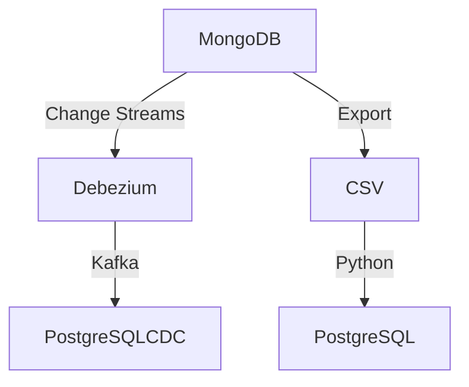

Here’s a step-by-step explanation of a **data transfer pipeline from MongoDB to PostgreSQL** using **Mermaid Flow Diagram** syntax, along with a visual representation.

---

### **Pipeline Overview**
The pipeline involves:
1. **Source (MongoDB)** → Extract data (e.g., via MongoDB Atlas Change Streams, MongoDB Export, or Scheduled Queries).
2. **Transformation (Optional)** → Clean, enrich, or transform data (e.g., using Python, Spark, or a CDC tool like Debezium).
3. **Load (PostgreSQL)** → Insert data into PostgreSQL tables.
4. **Monitoring & Error Handling** → Track success/failure and retry failed records.

---

### **Mermaid Flow Diagram**
```mermaid
flowchart TD
    %% MongoDB to PostgreSQL Pipeline
    A[MongoDB Source] --> B[Extract Data]
    B --> C[Transform Data] [[Optional: Clean, Enrich, Filter]]
    C --> D[Load Data]
    D --> E[PostgreSQL Destination]

    %% CDC (Change Data Capture) Option
    A --> F[CDC Tool: Debezium] -->|MongoDB Change Streams| G[Debezium Connector]
    G --> H[Kafka/Stream] --> I[PostgreSQL CDC Connector]

    %% Scheduled Export Option
    A --> J[Scheduled Export] --> K[Export to CSV/JSON] --> L[Load via Python/Spark]

    %% Error Handling & Monitoring
    D --> E[PostgreSQL] -->|Retry Failed| D
    E --> M[Monitoring: Alerts, Logs]

    %% Notes
    subgraph "CDC (Change Data Capture)"
        F --> G --> H --> I
    end

    subgraph "Batch Export"
        J --> K --> L
    end
```

---

### **Detailed Explanation**
#### **1. MongoDB Source (A)**
   - **MongoDB Atlas** or **MongoDB Server** stores data.
   - Use **Change Streams** (CDC) or **scheduled exports** to extract data.

#### **2. Extract Data (B)**
   - **Option 1: MongoDB Change Streams (CDC)**
     - Debezium captures real-time changes (inserts, updates, deletes) from MongoDB.
     - Connector writes changes to a **Kafka topic** or **database queue**.
   - **Option 2: Scheduled Export**
     - Use `mongodump`/`mongoexport` to export data periodically (e.g., daily).
     - Export format: JSON, CSV, or Parquet.

#### **3. Transform Data (C)**
   - **Optional Step**: Clean, enrich, or filter data before loading.
   - Tools:
     - **Python (Pandas, PyMongo)** for simple transformations.
     - **Spark** for large-scale processing.
     - **Debezium + Kafka Connect** for CDC transformations.

#### **4. Load Data (D)**
   - **Option 1: CDC (Debezium + PostgreSQL Connector)**
     - Debezium’s PostgreSQL connector consumes Kafka changes and applies them to PostgreSQL.
   - **Option 2: Batch Export (CSV/JSON)**
     - Use `psql` or Python (`psycopg2`) to load data into PostgreSQL.
     - Example:
       ```python
       import psycopg2
       conn = psycopg2.connect("dbname=postgres user=postgres")
       cursor = conn.cursor()
       cursor.execute("INSERT INTO pg_table VALUES (%s, %s)", (data1, data2))
       conn.commit()
       ```

#### **5. PostgreSQL Destination (E)**
   - Data is loaded into PostgreSQL tables.
   - Ensure **schema compatibility** (e.g., MongoDB `_id` → PostgreSQL `UUID`).

#### **6. Error Handling & Monitoring (M)**
   - **Retry Failed Records**: Use a queue (e.g., RabbitMQ) or retry logic in Python.
   - **Monitoring**: Log errors (e.g., using ELK Stack or Prometheus).
   - **Alerts**: Notify on failures (e.g., Slack, PagerDuty).

---

### **Example Mermaid Diagram (Simplified)**


---

### **Key Tools & Technologies**
| Step               | Tools/Technologies                          |
|--------------------|--------------------------------------------|
| **Extract**        | MongoDB Change Streams, Debezium, `mongodump` |
| **Transform**      | Python (Pandas), Spark, Kafka Streams       |
| **Load**           | Debezium PostgreSQL Connector, `psql`, Airflow |
| **Monitoring**     | Prometheus, Grafana, ELK Stack              |

---
### **When to Use CDC vs. Batch?**
| **CDC (Change Data Capture)** | **Batch Export** |
|-------------------------------|------------------|
| Real-time sync (e.g., financial data). | Periodic sync (e.g., nightly reports). |
| Handles updates/deletes.      | Only inserts (no updates/deletes). |
| Requires Kafka/Debezium.       | Simpler setup (no CDC tools). |

---
This pipeline ensures **data consistency** between MongoDB and PostgreSQL while handling errors and scalability.

---
> **Sources:** LLM Knowledge  
> **Confidence:** 0.90  
> **Mode:** quick  
> **Token Usage:** 1,911 tokens
