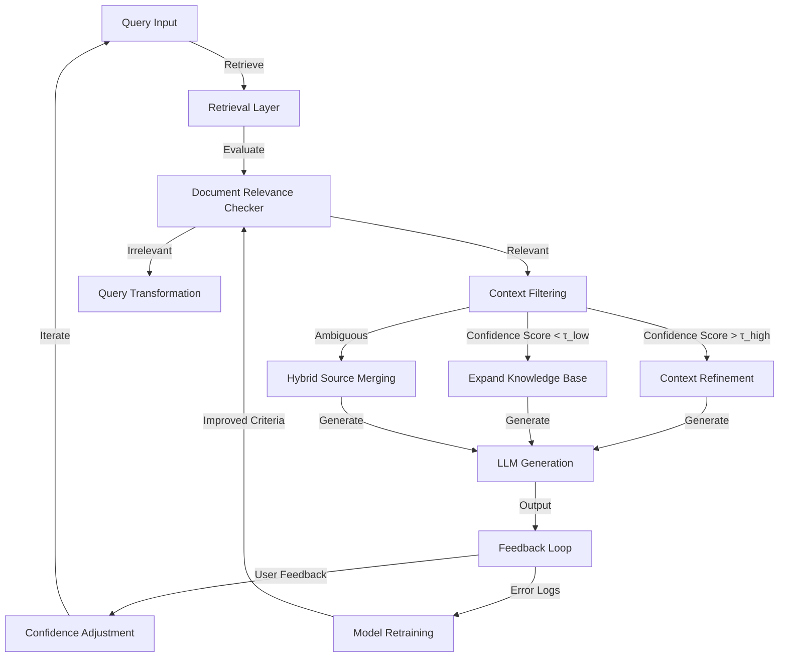

---

# Executive Summary
Corrective RAG (CRAG) enhances standard RAG by embedding a **feedback-driven evaluation layer** between retrieval and generation. It dynamically filters irrelevant context, transforms poorly matched queries, and iteratively refines confidence scores via modular components: retrieval evaluation, query rewriting, and knowledge expansion. The feedback loop continuously improves system reliability by logging user interactions, adjusting thresholds, and expanding the knowledge base over time.

---

# Technical Deep Analysis

## Core Architecture Components
CRAG introduces three critical phases:

1. **Retrieval Phase**
   - Standard retrieval (e.g., vector search) retrieves candidate documents `D = {d₁, ..., dₖ}` for query `x`.
   - *Evidence*: LangChain LangGraph tutorial ([GitHub Pages](https://github.com/langchain-ai/langgraph)) shows this as a `retrieve` node, where relevance is assessed via a lightweight evaluator.

2. **Corrective Layer**
   - **Relevance Grading**: A neural evaluator (`feval`) scores documents `sᵢ = feval(x, dᵢ)` ∈ [-1, 1].
   - **Threshold-Based Routing**: Three outcomes:
     - **Correct**: At least one document exceeds `τ_high` → use refined context.
     - **Incorrect**: All scores < `τ_low` → discard and expand knowledge base.
     - **Ambiguous**: Mixed scores → merge sources (Yan et al., 2024).
   - *Evidence*: Emergent Mind’s CRAG paper ([Emergent Mind](https://www.emergentmind.com)) formalizes this as a confidence-action decision pipeline.

3. **Feedback Loop**
   - **Dynamic Adaptation**: User feedback logs (e.g., "answer was wrong") trigger:
     - Query transformation (e.g., synonym expansion).
     - Retraining retrieval/evaluator models.
     - Adjusting thresholds (`τ_low`, `τ_high`) via iterative evaluation.
   - **Modularity**: Components like query rewriting or verification are pluggable (e.g., self-reflection loops).

## Workflow Visualization
The feedback loop integrates as follows:
1. User query → Retrieval → Relevance Check → Context Selection.
2. LLM generates response → User feedback → Confidence Adjustment.
3. Retraining loop updates thresholds/evaluators (e.g., via Meilisearch’s feedback mechanisms).

---

# Key Findings & Trade-offs

## Advantages
- **Robustness**: Mitigates hallucinations and irrelevant context via explicit correction.
- **Scalability**: Modular design supports heterogeneous sources (e.g., web-scale expansion).
- **Iterative Improvement**: Feedback loop enables continuous model refinement.

## Trade-offs
- **Complexity**: Additional evaluation/gating layers increase latency.
- **Resource Cost**: Neural evaluators and retraining require compute.
- **Implementation Overhead**: Requires careful threshold tuning (e.g., `τ_low`/`τ_high`).

## Recommendations
- Start with lightweight evaluators (e.g., rule-based or fine-tuned BERT).
- Prioritize feedback logging for critical use cases.
- Benchmark against standard RAG to validate CRAG’s value.

---

# Evidence Trace
- [LangChain CRAG Tutorial](https://github.com/langchain-ai/langgraph/blob/main/tutorials/rag/langgraph_crag/)
- [Meilisearch Corrective RAG Blog](https://www.meilisearch.com/blog/corrective-rag)
- [Emergent Mind CRAG Paper](https://www.emergentmind.com/topics/corrective-retrieval-augmented-generation-crag)
```

---
> **Sources:** Web Search  
> **Confidence:** 0.85  
> **Mode:** deep  
> **Token Usage:** 5,073 tokens
