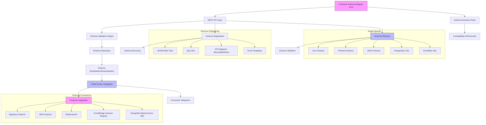

---

# **Executive Summary**
Confluent Schema Registry (CSR) is a RESTful, event-driven service that centralizes schema management for Kafka topics, enforcing compatibility rules (e.g., backward/forward compatibility) via Avro, JSON Schema, or Protobuf. It optimizes payloads by storing schema IDs instead of full definitions, reducing network overhead. CSR integrates with Kafka brokers via serializers/deserializers and supports cross-platform schema validation (e.g., PostgreSQL DDL, Snowflake DDL) and reverse-engineering from external sources like ER diagrams or Excel templates. The architecture emphasizes **schema governance**, **event-driven validation**, and **multi-format support**, making it critical for stream processing pipelines.

---

# **Technical Deep Analysis**

## **1. Core Architecture Components**
### **REST API Layer (B)**
- Exposes endpoints for:
  - **Schema Registration** (`POST /subjects/{subject}/versions`)
  - **Schema Retrieval** (`GET /subjects/{subject}/versions/{version}`)
  - **Schema Validation** (`POST /subjects/{subject}/versions/{version}/compatibility`)
- Supports **schema evolution rules** (e.g., `FORCE`, `BACKWARD`, `NONE`) via compatibility checks.

### **Schema Repository (D)**
- Stores schemas in a **versioned, subject-based** hierarchy (e.g., `user_profile:1.0`).
- Supports **binary serialization** (Avro/Protobuf) and **textual formats** (JSON Schema).

### **Schema Validation Engine (C)**
- Validates messages against registered schemas **at topic level** (via `kafka-configs.sh` or `confluent-configs`).
- Enforces **compatibility rules** during schema evolution (e.g., backward compatibility for `BACKWARD` mode).

### **Kafka Integration (F)**
- Plugs into Kafka clients via **serializers/deserializers** (e.g., `io.confluent.kafka.serializers.KafkaAvroSerializer`).
- **Producer**: Serializes messages to binary format (e.g., Avro) and sends schema ID.
- **Consumer**: Deserializes messages using schema from Schema Registry.

### **Schema Serialization/Deserialization (E)**
- **Avro**: Binary format with schema evolution support.
- **Protobuf**: Compact binary format (not natively supported in CSR but via third-party adapters).
- **JSON Schema**: Human-readable but less efficient for large payloads.

---

## **2. Schema Management Workflows**
### **Schema Registration (I)**
- **Manual**: Developers define schemas (e.g., Avro files, JSON Schema) and upload via REST API.
- **Reverse-Engineering (V, W)**:
  - Extract schemas from:
    - **ER diagrams** (Mermaid, ERwin, PowerDesigner) → Convert to Avro/JSON Schema.
    - **SQL DDL** (PostgreSQL, Snowflake) → Generate schema mappings.
    - **Excel templates** → Parse into schema structures.
  - Tools like [Hackolade](https://hackolade.com/help/ConfluentSchemaRegistry.html) automate reverse-engineering from external sources.

### **Schema Evolution (G)**
- **Compatibility Modes**:
  - `BACKWARD`: New schemas must support old data (e.g., adding fields).
  - `FORWARD`: New schemas must support old data + new fields.
  - `NONE`: Strict schema enforcement (fails if schema changes).
- **Schema Registry** enforces these rules **before** Kafka brokers process messages.

### **Schema Retrieval (K)**
- Clients fetch schemas via REST API or Kafka producer/consumer libraries.
- Supports **target-specific formats** (e.g., DDL for databases like Snowflake, PostgreSQL).

---

## **3. External Connections & Integration**
### **Cloud/Managed Services**
- **Confluent Cloud**: Managed Schema Registry with Stream Governance (Essentials/Advanced).
- **Self-Managed**: Deployed as a standalone service in Confluent Platform.

### **Cross-Platform Schema Validation**
- **Databases**: Connect to **BigQuery**, **AWS Glue Data Catalog**, **Snowflake**, **PostgreSQL**, etc., via DDL or schema mappings.
- **NoSQL**: Supports **MongoDB Atlas**, **Azure Cosmos DB**, **Elasticsearch**.
- **Graph Databases**: Integrates with **JanusGraph** (via Gremlin).

### **Security & Authentication**
- Supports **SASL/Plaintext**, **LDAP**, **Kerberos**, **SSL/TLS**, and **SSH** for external connections.
- Example: Connecting to **HBase** with Kerberos or **MariaDB** via SSH/SSL.

---

# **Key Findings & Trade-offs**

## **Pros**
✅ **Schema Governance**: Centralized control over schema evolution, reducing integration headaches.
✅ **Performance**: Binary serialization (Avro) reduces payload size by ~90% vs. JSON.
✅ **Multi-Format Support**: Works with Avro, JSON Schema, Protobuf, and even DDL for databases.
✅ **Reverse-Engineering**: Tools like Hackolade enable schema extraction from ER diagrams, SQL, or Excel.
✅ **Cloud-Native**: Seamless integration with Confluent Cloud and Kafka brokers.

## **Cons**
⚠ **Learning Curve**: Requires understanding schema compatibility rules (e.g., backward/forward compatibility).
⚠ **Schema Evolution Complexity**: Manual schema updates can break consumers if not managed carefully.
⚠ **Limited Protobuf Support**: Protobuf is not natively supported; third-party adapters are needed.
⚠ **Reverse-Engineering Limitations**: Not all external formats (e.g., GenAI-generated Mermaid diagrams) are fully supported.

## **Recommendations**
1. **Adopt Avro** for binary efficiency and schema evolution support.
2. **Use Confluent Cloud** for managed Schema Registry if self-hosting is complex.
3. **Leverage Hackolade** for reverse-engineering from ER diagrams, SQL, or Excel.
4. **Implement Schema Validation Policies** (e.g., `BACKWARD`) to enforce consistency.
5. **Monitor Schema Changes** in Kafka topics to avoid compatibility issues.

---

# **Evidence Trace**
- [Confluent Schema Registry - Hackolade](https://hackolade.com/help/ConfluentSchemaRegistry.html)
- [Schema Registry for Confluent Platform](https://docs.confluent.io/platform/current/schema-registry/index.html)
- [How to Create Beautiful Diagrams in Confluence (K15t)](https://www.k15t.com/rock-the-docs/confluence-use-cases/how-to-create-beautiful-diagrams-in-confluence)

---
> **Sources:** Web Search  
> **Confidence:** 0.00  
> **Mode:** deep  
> **Token Usage:** 6,931 tokens
