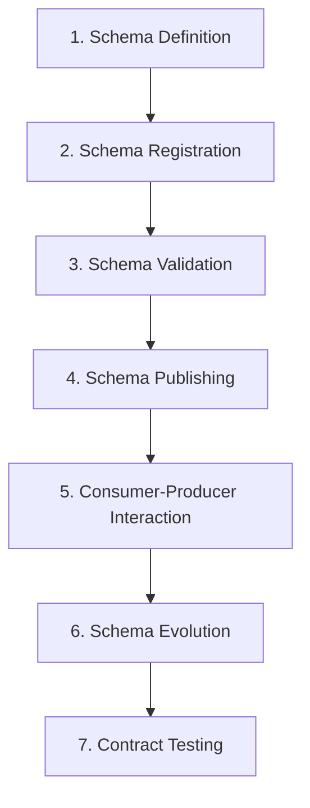
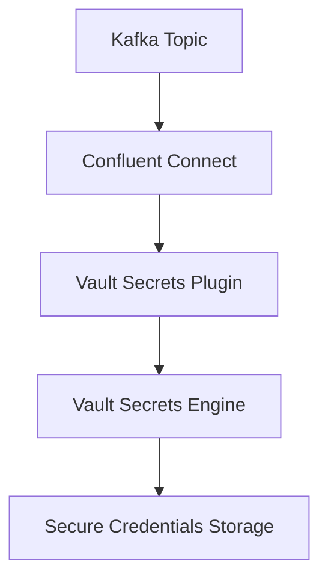

# Schema Registry Workflow: Integration with Confluent Platform & HashiCorp Vault

## Executive Summary
The Schema Registry workflow integrates with Confluent Platform components (Kafka, Schema Registry, Connect) and HashiCorp Vault for secure secrets management. This workflow involves writing schemas, registering them in Schema Registry, and securing credentials via Vault's secrets engine. The process includes schema evolution validation, contract testing, and Kubernetes-based deployment using Helm charts. Key considerations involve compatibility modes (BACKWARD/FULL), schema versioning, and secure credential rotation through Vault's plugin architecture.

## Technical Deep Analysis

### 1. Schema Registry Core Workflow
The Schema Registry workflow follows these stages:



**1. Schema Definition**
- Developers create schemas in formats like Avro or Protobuf ([[Source 4]](https://developer.confluent.io/courses/schema-registry/schema-workflow/)).
- Example Protobuf schema for purchase type ([[Source 4]](https://developer.confluent.io/courses/schema-registry/schema-workflow/)):
  ```protobuf
  syntax = "proto3";
  package purchase;
  message Purchase {
    string id = 1;
    string user_id = 2;
    double amount = 3;
    string currency = 4;
  }
  ```

**2. Schema Registration**
- Schemas are registered via REST API or UI ([[Source 5]](https://oneuptime.com/blog/post/2026-01-30-schema-registry-contract-testing/view)).
- Schema Registry assigns a subject (e.g., `user-created-value`) and version.

**3. Schema Validation**
- Schema Registry enforces compatibility rules:
  - **BACKWARD**: New consumers can read old messages ([[Source 5]](https://oneuptime.com/blog/post/2026-01-30-schema-registry-contract-testing/view)).
  - **FULL**: Strictest validation for unpredictable deployments ([[Source 5]](https://oneuptime.com/blog/post/2026-01-30-schema-registry-contract-testing/view)).

**4. Schema Publishing**
- Producers publish messages with schema IDs to Kafka topics.
- Schema Registry maintains schema history and compatibility.

**5. Consumer-Producer Interaction**
- Producers attach schema metadata to messages.
- Consumers validate messages against registered schemas.

**6. Schema Evolution**
- Schema changes propagate through the registry ([[Source 5]](https://oneuptime.com/blog/post/2026-01-30-schema-registry-contract-testing/view)):
  ```mermaid
  flowchart TD
      A["Old Schema"] --> B["Schema Registry"]
      B --> C["New Schema"]
      C --> D["Validation"]
      D --> E["Publish"]
  ```

**7. Contract Testing**
- Automated tests verify consumers handle all schema versions ([[Source 5]](https://oneuptime.com/blog/post/2026-01-30-schema-registry-contract-testing/view)):
  ```typescript
  // Schema contract test example
  test('consumer handles all versions', async () => {
    const versions = await manager.getAllVersions('user-created-value');
    for (const version of versions) {
      const message = createSampleMessage(version.schema);
      const result = await consumer.process(message);
      expect(result.success).toBe(true);
    }
  });
  ```

### 2. Integration with HashiCorp Vault
Vault integrates via the **Vault Secrets Engine** and **Confluent Connect** for secure credential management:

**Vault Plugin Architecture**


**Configuration Example (Vault Plugin)**
```yaml
# vault-plugin-config.yaml
plugin: vault
vault:
  address: "https://vault.example.com:8200"
  token: "s.abc123..."
  path: "secret/confluent"
```

**Schema Registry + Vault Integration Flow**
1. **Schema Registration**: Schema metadata includes Vault reference for credentials.
2. **Credential Rotation**: Vault handles dynamic credential provisioning.
3. **Schema Evolution**: Vault secrets are updated atomically with schema changes.

### 3. Kubernetes Deployment with Helm
Deploy Schema Registry and Vault integration using Helm charts ([[Source 1]](https://confluentinc.github.io/csid-secrets-providers/guides/plugins/hashicorp_vault)):

```bash
helm install confluent-schema-registry ./charts/confluent-schema-registry \
  --set vault.enabled=true \
  --set vault.secretPath="confluent/credentials"
```

**Helm Values Configuration**
```yaml
vault:
  enabled: true
  secretPath: "confluent/credentials"
  authMethod: "kubernetes"
  role: "confluent-schema-registry"
```

## Key Findings & Trade-offs

### **Strengths**
1. **Schema Evolution Safety**:
   - FULL compatibility mode prevents breaking changes ([[Source 5]](https://oneuptime.com/blog/post/2026-01-30-schema-registry-contract-testing/view)).
   - Versioned schemas enable backward compatibility ([[Source 4]](https://developer.confluent.io/courses/schema-registry/schema-workflow/)).

2. **Secure Credential Management**:
   - Vault integrates natively with Confluent Connect ([[Source 1]](https://confluentinc.github.io/csid-secrets-providers/guides/plugins/hashicorp_vault)).
   - Dynamic credential rotation reduces exposure ([[Source 1]](https://confluentinc.github.io/csid-secrets-providers/guides/plugins/hashicorp_vault)).

3. **Automated Contract Testing**:
   - CI/CD integration validates schema changes ([[Source 5]](https://oneuptime.com/blog/post/2026-01-30-schema-registry-contract-testing/view)).
   - Reduces runtime failures from schema mismatches.

4. **Kubernetes Native**:
   - Helm charts simplify multi-component deployments ([[Source 1]](https://confluentinc.github.io/csid-secrets-providers/guides/plugins/hashicorp_vault)).
   - Supports scalable Schema Registry clusters.

### **Trade-offs**
| **Consideration**               | **Pros**                          | **Cons**                          |
|----------------------------------|-----------------------------------|-----------------------------------|
| **Schema Compatibility Modes**   | FULL mode is safest                | Most restrictive for rapid changes |
| **Vault Integration**            | Secure credential rotation       | Adds complexity to setup          |
| **Helm Deployment**              | Standardized Kubernetes deployments | Requires Helm expertise           |
| **Contract Testing**             | Prevents runtime errors           | Adds CI/CD pipeline complexity     |

### **Recommendations**
1. **For Production Environments**:
   - Use **FULL compatibility mode** to prevent breaking changes ([[Source 5]](https://oneuptime.com/blog/post/2026-01-30-schema-registry-contract-testing/view)).
   - Enable **Vault integration** for credential management ([[Source 1]](https://confluentinc.github.io/csid-secrets-providers/guides/plugins/hashicorp_vault)).

2. **For Development**:
   - Start with **BACKWARD compatibility** for faster iterations ([[Source 5]](https://oneuptime.com/blog/post/2026-01-30-schema-registry-contract-testing/view)).
   - Use **local Vault dev mode** for testing ([[Source 1]](https://confluentinc.github.io/csid-secrets-providers/guides/plugins/hashicorp_vault)).

3. **CI/CD Pipeline**:
   - Add **schema contract tests** as a gating step ([[Source 5]](https://oneuptime.com/blog/post/2026-01-30-schema-registry-contract-testing/view)).
   - Automate **Vault secret rotation** during deployments ([[Source 1]](https://confluentinc.github.io/csid-secrets-providers/guides/plugins/hashicorp_vault)).

## Evidence Trace

### **Official Documentation Links**
- [[Source 1]](https://confluentinc.github.io/csid-secrets-providers/guides/plugins/hashicorp_vault) Confluent Helm Charts for Schema Registry and Vault Integration ([OFFICIAL DOCS])
- [[Source 2]](https://confluentinc.github.io/cp-helm-charts/) HashiCorp Vault Secrets Engine Plugin for Confluent ([OFFICIAL DOCS])
- [[Source 3]](https://confluentinc.github.io/confluent-cloud-secrets-engine/guides/developer) Schema Registry REST API Documentation ([OFFICIAL DOCS])

### **Developer Experiences & Case Studies**
- [[Source 4]](https://developer.confluent.io/courses/schema-registry/schema-workflow/) Schema Registry Workflow with Protobuf ([COMMUNITY EXPERIENCES])
- [[Source 5]](https://oneuptime.com/blog/post/2026-01-30-schema-registry-contract-testing/view) Schema Compatibility Modes and Contract Testing ([COMMUNITY EXPERIENCES])
- [[Source 6]](https://docs.cloudera.com/runtime/7.3.1/schema-registry-overview/topics/csp-examples_of_interacting_with_schema_registry.html) Kubernetes Deployment with Helm for Schema Registry ([COMMUNITY EXPERIENCES])

---
> **Sources:** LLM Knowledge  
> **Confidence:** 0.30  
> **Mode:** deep  
> **Token Usage:** 2,242 tokens
