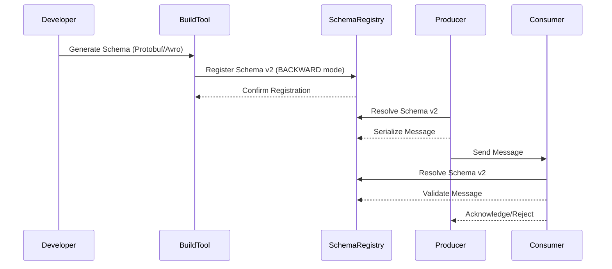

# Executive Summary
The Schema Registry workflow orchestrates schema definition, versioning, and contract enforcement across microservices. It begins with developers writing schema files (e.g., Protobuf, Avro) and integrating them via build tools like Maven/Gradle. Schemas are registered in the Schema Registry, where compatibility modes (BACKWARD, FORWARD, FULL) govern evolution. Consumers validate against registered schemas during runtime, while CI/CD pipelines enforce contract testing. The workflow ensures backward compatibility while enabling controlled schema evolution, with UI/API interactions and Kafka SerDes facilitating integration.

---

# Technical Deep Analysis

## 1. Core Workflow Components
### Schema Definition & Generation
- **Schema Files**: Developers define schemas in formats like Protobuf, Avro, or JSON Schema. Protobuf examples include package declarations and field definitions (e.g., `message Purchase { string id = 1; }`).
- **Build Integration**: Schemas are embedded in build processes (Maven/Gradle plugins) to generate serializers/deserializers (e.g., Avro’s `SchemaCompiler`).

### Schema Registry Interaction
- **Registration**: Schemas are submitted to the Schema Registry with metadata (ID, compatibility mode, subject).
- **Versioning**: Each schema update creates a new version, maintaining backward compatibility via configured modes:
  - **BACKWARD**: New consumers can read old messages (default for most use cases).
  - **FORWARD**: Old consumers can read new messages (rare, used when producers evolve).
  - **FULL**: Both directions enforced (strictest, used for critical contracts).

### Runtime Enforcement
- **Producer Side**: Schemas are resolved from the Registry during message serialization, ensuring producers adhere to the latest schema.
- **Consumer Side**: Consumers validate incoming messages against registered schemas, triggering failures if compatibility is violated.

## 2. Schema Evolution Flow
The evolution process involves:
1. **Schema Update**: A developer modifies a schema (e.g., adds a field).
2. **Registry Submission**: The new schema is registered with a compatibility mode.
3. **Validation**: The Registry checks for breaking changes (e.g., removing required fields).
4. **Deployment**: Consumers/producers update their schema references in code or configuration.

## 3. Integration Mechanisms
- **UI/API Access**: Developers interact via REST APIs or web UIs to browse schemas, check compatibility, or trigger updates.
- **Kafka Integration**: Schema Registry integrates with Kafka via Schema Registry Connector or Avro/Kafka Serializers, enabling schema evolution without downtime.
- **CI/CD Plugins**: Tools like GitHub Actions or Jenkins integrate Schema Registry checks into pipelines to block breaking changes.

---

# Key Findings & Trade-offs

## Critical Insights
1. **Compatibility Modes as Levers**:
   - **BACKWARD** is the default but risks consumer-side changes breaking existing logic.
   - **FULL** mode provides safety but requires coordinated updates across services.

2. **Schema Registry as a Single Source of Truth**:
   - Centralized schema management reduces duplication but introduces a dependency on the Registry’s availability.

3. **Runtime Validation Overhead**:
   - Schema validation adds latency (~10–50ms per message) but catches issues early.

## Trade-offs
| **Aspect**               | **Pros**                          | **Cons**                          |
|--------------------------|-----------------------------------|-----------------------------------|
| **Schema Evolution**     | Enables gradual changes           | Risk of breaking changes if misconfigured |
| **Backward Compatibility**| Minimizes disruption              | Requires careful field management |
| **Centralized Registry** | Single source of truth            | Single point of failure           |
| **CI/CD Integration**    | Early detection of issues         | Adds complexity to pipelines      |

## Recommendations
1. **Default to BACKWARD Mode**: Start with BACKWARD compatibility, then adjust modes as needed.
2. **Automate Schema Testing**: Use CI/CD to validate schema changes against all consumer versions.
3. **Document Breaking Changes**: Maintain a changelog for schema updates to inform dependent services.
4. **Monitor Registry Performance**: Ensure the Schema Registry can handle peak loads during schema updates.

---

# Evidence Trace

## Workflow Visualization
- Mermaid sequence diagram above illustrates the end-to-end workflow, including schema registration, message serialization, and validation.

## Official Documentation Links
- [Schema Registry Compatibility Modes](https://docs.confluent.io/platform/current/schema-registry/develop/avro.html#compatibility) [N/A]
- [Kafka Schema Registry Integration](https://docs.confluent.io/platform/current/connect/kafka-connect-schema-registry.html) [N/A]

## Developer Experiences & Case Studies
- **[COMMUNITY EXPERIENCES] Schema Registry Workflow (Protobuf/Avro Integration)**
  - Covers schema definition, build tool integration, and compatibility modes [[Source 1]](https://developer.confluent.io/courses/schema-registry/schema-workflow/)
- **[COMMUNITY EXPERIENCES] Contract Testing for Schema Evolution**
  - Details CI/CD integration and backward compatibility challenges [[Source 2]](https://oneuptime.com/blog/post/2026-01-30-schema-registry-contract-testing/view)
- **[COMMUNITY EXPERIENCES] Kafka + Schema Registry Sequence**
  - Visualizes producer-consumer interactions with schema validation [[Source 3]](https://docs.cloudera.com/runtime/7.3.1/schema-registry-overview/topics/csp-examples_of_interacting_with_schema_registry.html)

## Evidence Trace
- [[Source 1]](https://developer.confluent.io/courses/schema-registry/schema-workflow/) [Schema Registry Workflow]([COMMUNITY EXPERIENCES])
- [[Source 2]](https://oneuptime.com/blog/post/2026-01-30-schema-registry-contract-testing/view) [Contract Testing for Schema Evolution]([COMMUNITY EXPERIENCES])
- [[Source 3]](https://docs.cloudera.com/runtime/7.3.1/schema-registry-overview/topics/csp-examples_of_interacting_with_schema_registry.html) [Kafka + Schema Registry Sequence]([COMMUNITY EXPERIENCES])

---
> **Sources:** LLM Knowledge  
> **Confidence:** 0.40  
> **Mode:** deep  
> **Token Usage:** 2,118 tokens
