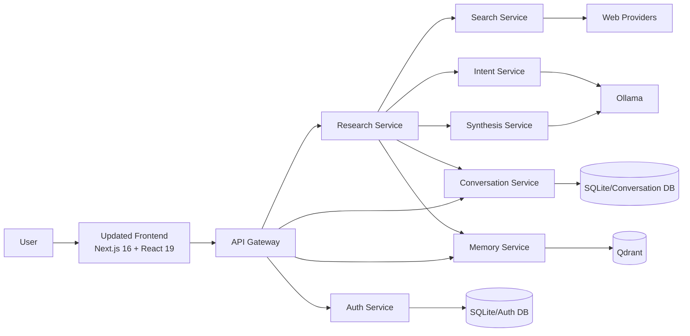
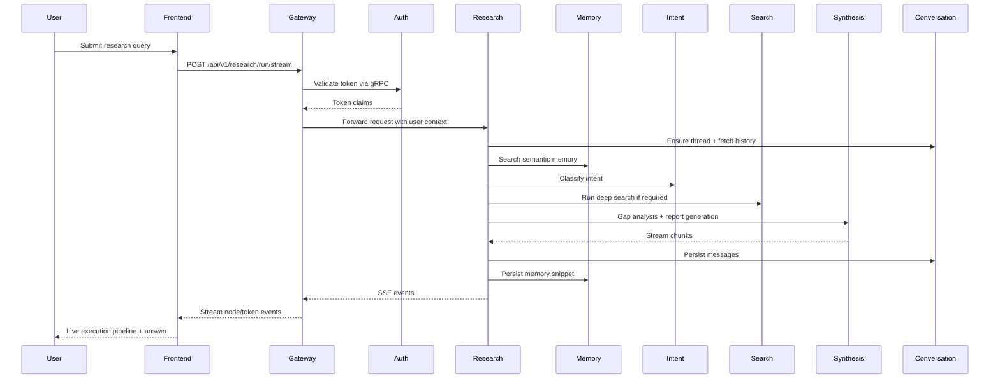
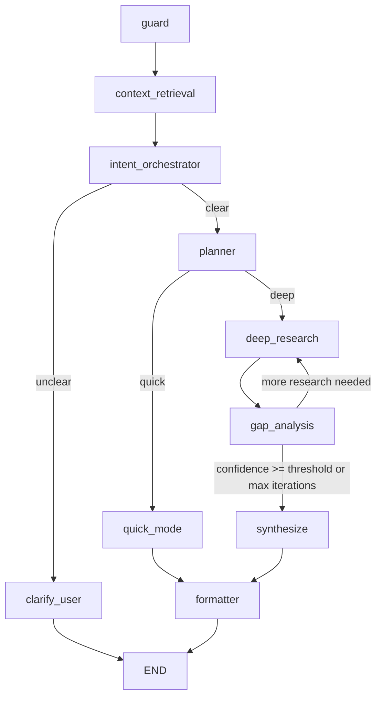
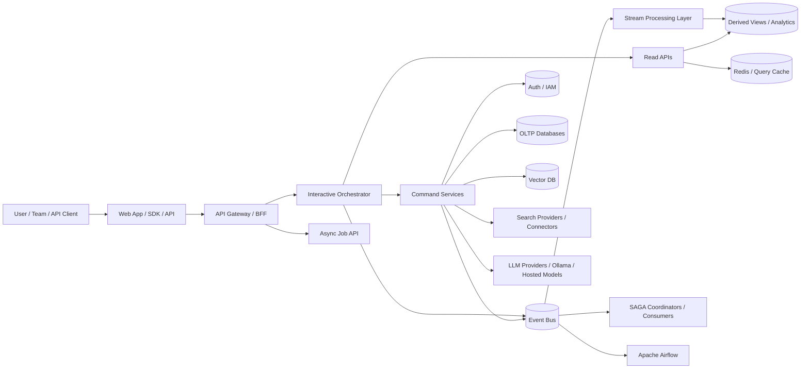

# AI Research Agent Pitch Desk

## 1. Executive Summary

AI Research Agent is a microservices-based, agentic research platform that helps users move from a raw technical question to a structured, cited, explainable answer. Unlike generic AI chat tools, it exposes the execution pipeline, preserves conversation history, uses semantic memory, and iteratively deepens research when confidence is low.

The current system already demonstrates a strong product foundation:

- multi-service backend with clear service boundaries
- LangGraph-based orchestration for quick and deep research modes
- real-time SSE response streaming
- semantic memory via Qdrant
- persistent thread and message history
- JWT and OAuth-based authentication
- unified observability pattern across backend and frontend
- a newer `updated_frontend` Next.js app with tests and execution-pipeline UX

This document combines the current architecture with a future-ready product and platform roadmap, including stream processing, event-driven orchestration, advanced deployment topologies, and business planning.

## 2. Problem Statement

Technical teams, founders, product managers, analysts, and researchers lose significant time in:

- searching across many sources
- evaluating conflicting information
- synthesizing findings into a usable report
- maintaining continuity across sessions
- understanding how an AI answer was actually produced

Most AI assistants optimize for fast answers, not transparent research workflows. That leads to:

- opaque reasoning
- weak traceability
- no reusable memory
- little orchestration across tools and services
- poor fit for enterprise-grade auditability

## 3. Solution Statement

AI Research Agent provides a transparent, composable research workflow that:

- classifies user intent first
- retrieves prior memory for context reuse
- chooses quick or deep research mode
- loops through gap analysis until confidence improves
- synthesizes a structured report with citations and diagrams
- streams progress live to the user
- persists the result into memory and thread history

## 4. What Makes It Different

### USP

1. Explainable AI execution
   Users can see the node-by-node execution pipeline instead of receiving a black-box answer.

2. Memory-backed research continuity
   The platform reuses relevant prior context through vector search, reducing repeated work.

3. Adaptive research depth
   The system intelligently chooses quick response mode or deeper iterative web research.

4. Microservices by design
   Authentication, search, synthesis, memory, intent, research, and conversation are independently evolvable.

5. Enterprise-friendly architecture path
   The current design can evolve toward event-driven, auditable, horizontally scalable enterprise workflows.

### Core Differentiators vs Typical AI Chat

| Capability | Generic Chat Tool | AI Research Agent |
|---|---|---|
| Transparent pipeline | Usually no | Yes |
| Semantic memory | Limited | Yes |
| Thread persistence | Basic | Yes |
| Multi-step orchestration | Limited | Yes |
| Iterative gap analysis | Rare | Yes |
| Service isolation | No | Yes |
| Future enterprise integration path | Weak | Strong |

## 5. Current Product Scope

### Current User Journey

1. User logs in with email/password or OAuth.
2. User creates or selects a thread.
3. User submits a technical query.
4. API Gateway validates auth and routes request.
5. Research service runs the LangGraph workflow.
6. Frontend shows pipeline progress and streams the generated answer.
7. Final result is stored in conversation history and semantic memory.

### Current Implemented Product Features

- JWT-based authentication with refresh token rotation
- Google and GitHub OAuth
- conversation threads and message history
- semantic memory lookup and storage
- multi-provider search orchestration
- synthesis and gap analysis with Ollama-backed LLM calls
- streaming report generation
- Mermaid rendering in frontend output
- health endpoints and issue/stats endpoints for observability
- Playwright and Vitest coverage for the new frontend
- pytest coverage for backend services and shared observability modules

## 6. Current Architecture Snapshot

### Service Map

| Layer | Component | Current Role |
|---|---|---|
| Frontend | `updated_frontend` | Primary modern UI, auth, threads, SSE pipeline rendering |
| Frontend | `frontend` | Older Streamlit UI still referenced in compose |
| Edge | API Gateway | Auth enforcement, routing, aggregated health |
| Core Orchestrator | Research Service | LangGraph workflow execution |
| Intelligence | Intent Service | Query classification and clarification |
| Intelligence | Synthesis Service | Report generation and gap analysis |
| Retrieval | Search Service | Tavily, Google CSE, DuckDuckGo, page enrichment |
| Memory | Memory Service | Qdrant vector storage and semantic retrieval |
| Persistence | Conversation Service | Thread and message storage |
| Identity | Auth Service | User, JWT, refresh, OAuth, token validation |
| Shared Platform | `backend/shared` | DTOs, observability, middleware, gRPC contracts |

### Important Current-State Notes

- The new web application is under `updated_frontend`.
- `docker-compose.yml` still points to the older `frontend` Streamlit container.
- Current persistence is SQLite-based for auth and conversations, with Qdrant for vector memory.
- gRPC is already used internally for several service interactions.
- SSE is used for streaming research progress to the UI.

## 7. Current HLD

## 8. Current Request Flow

## 9. LangGraph Execution Pipeline

### Current Graph

### What Each Node Does

| Node | Current Purpose |
|---|---|
| `guard` | initializes query id, counters, path |
| `context_retrieval` | fetches user-scoped memory context |
| `intent_orchestrator` | classifies technical intent and clarity |
| `clarify_user` | returns clarification prompt when needed |
| `planner` | selects quick or deep mode |
| `quick_mode` | synthesizes from memory or direct query context |
| `deep_research` | runs web search on main query and gap-guided follow-ups |
| `gap_analysis` | checks confidence and missing topics |
| `synthesize` | produces final report |
| `formatter` | stores memory and persists conversation |

### Current Research Modes

- `quick`
  Best for general, concept, and bug-style queries where memory or lightweight reasoning is enough.

- `deep`
  Best for architecture, comparison, and research queries that need iterative web exploration.

## 10. Technology Assessment

### Backend

- Python FastAPI services
- LangGraph orchestration
- gRPC for internal service calls
- Qdrant for vector memory
- Ollama-backed local LLM inference
- SQLAlchemy and SQLite for transactional state
- docker-compose-based local deployment

### Frontend

- Next.js 16
- React 19
- TypeScript
- Zustand
- Framer Motion
- Mermaid rendering
- Playwright and Vitest

### Architecture Strengths

- strong separation of concerns
- clean ports-and-adapters structure
- clear path for service-by-service scaling
- practical observability framework already embedded
- real-time UX increases trust and perceived intelligence

### Current Constraints

- some docs still describe older frontend/runtime details
- production deployment path is not yet fully codified
- stateful local databases constrain scale-out
- current system is mostly request/response with limited async eventing
- compose still references legacy frontend instead of `updated_frontend`

## 11. Business Positioning

### Ideal Customer Profiles

- startup engineering teams
- developer tooling companies
- internal enterprise research teams
- product strategy and solutions engineering teams
- consulting and architecture advisory teams
- technical education and knowledge operations teams

### Primary Use Cases

- architecture research
- technology comparison
- incident or bug investigation support
- developer onboarding knowledge assistant
- internal RFP and solution drafting
- engineering design memo preparation

## 12. Business Study

### Why This Can Win

1. Trust
   Pipeline transparency is more credible than black-box outputs.

2. Efficiency
   Memory reuse and persistent threads reduce repeat effort.

3. Modularity
   The architecture allows product packaging for SMB, enterprise, or internal platform teams.

4. Extensibility
   Current service boundaries support future compliance, analytics, connectors, and orchestration.

### Buyer Value

| Buyer | Value |
|---|---|
| CTO / VP Eng | team productivity, architecture acceleration, reuse of knowledge |
| Engineering Manager | reduced research overhead, better traceability |
| Product / Strategy | faster market and technical comparison reports |
| Platform Team | reusable internal AI capability with service boundaries |

### Commercial Positioning

- B2B SaaS research copilot
- enterprise internal knowledge and architecture assistant
- API-first orchestration platform for agentic research workflows

## 13. Monetization Options

### Option A: SaaS Subscription

- Free tier with low monthly token quota
- Pro tier for individual power users
- Team tier with shared workspace and analytics
- Enterprise tier with SSO, governance, private deployment

### Option B: Usage-Based

- charge per research run
- charge per deep research iteration
- charge by token or compute bundle
- charge for premium connectors and source packs

### Option C: Hybrid

- base subscription
- overage billing for deep research and premium orchestration

## 14. Financial Planning Assumptions

These are planning assumptions derived from the current architecture, not audited market or revenue forecasts.

### Major Cost Drivers

- LLM inference cost
- search provider API cost
- compute for orchestration and streaming
- vector storage and retrieval
- observability and logging retention
- engineering and support headcount

### Current Cost Shape

- lower inference cost possible when Ollama runs locally
- higher ops complexity if self-hosting models
- API search costs grow with deep research volume
- current SQLite setup keeps infra cheap for MVP stages

### Illustrative Monthly Cost Model

| Stage | Users / Month | Infra Shape | Likely Cost Pattern |
|---|---:|---|---|
| MVP | 50-200 | single-node or low-scale containers | low |
| Early Beta | 200-1,000 | managed containers + Qdrant + hosted DB | low-medium |
| Growth | 1,000-10,000 | autoscaled services + queueing + observability stack | medium-high |
| Enterprise | 10,000+ | multi-env, HA infra, compliance, analytics | high |

### Suggested Revenue Model

| Tier | Indicative Target |
|---|---|
| Free | onboarding and feedback loop |
| Pro | individual researchers and developers |
| Team | shared usage, thread collaboration, admin controls |
| Enterprise | SSO, audit logs, VPC/private deployment, custom connectors |

### Unit Economics Levers

- increase quick-mode hit rate to reduce expensive deep research runs
- cache repeated synthesis and search outputs
- use budget policies by customer tier
- move heavy analytics and offline enrichment to async pipelines
- use event-driven persistence instead of synchronous fan-out where appropriate

## 15. Go-To-Market Plan

### Phase 1

- target engineering founders and developer teams
- use architecture comparison and research-report generation as primary hook
- show transparent pipeline and live execution as core demo experience

### Phase 2

- package as team research workspace
- add connectors to internal docs and enterprise knowledge sources
- push enterprise-ready deployment and governance story

### Phase 3

- position as agentic research platform
- enable API, workflow, and orchestration integrations
- support internal enterprise copilots and knowledge workflows

## 16. Current Functional Requirements

### Current FRS

1. User registration, login, logout, and token refresh
2. OAuth sign-in with Google and GitHub
3. Authenticated request routing through API Gateway
4. Thread creation, retrieval, and deletion
5. Message history persistence and retrieval
6. Query classification into supported intent categories
7. Clarification flow for unclear or non-technical queries
8. Semantic memory retrieval by user
9. Semantic memory storage after successful runs
10. Multi-provider search with fallback behavior
11. Gap analysis and iterative research loop
12. Final report synthesis with citations
13. Real-time SSE streaming of pipeline progress and token output
14. Health, issue, and stats endpoints across services
15. Frontend rendering of markdown and Mermaid output

## 17. Future Functional Requirements

### Future FRS

1. Workspace and team-level collaboration
2. Role-based access control and enterprise admin panel
3. Source connector framework for Confluence, Notion, Jira, GitHub, Slack, SharePoint
4. Saved research templates and reusable workflows
5. Evaluation and scoring of response quality
6. Human-in-the-loop approval for sensitive flows
7. Report export to PDF, DOCX, and presentation formats
8. Fine-grained policy engine for cost, compliance, and data locality
9. Real-time analytics dashboards
10. Async batch research jobs and scheduled recurring reports
11. Multi-agent pipeline variants for specialized verticals
12. Knowledge graph enrichment and entity linking

## 18. Current Non-Functional Requirements

### Current NFRS

| Category | Current State |
|---|---|
| Availability | suitable for dev/demo environments, not yet HA |
| Performance | supports real-time streaming and internal gRPC calls |
| Scalability | modular services, but persistence and orchestration are not yet fully horizontally hardened |
| Security | JWT, refresh rotation, OAuth, user scoping |
| Observability | good baseline with prevention, detection, avoidance, rectification |
| Maintainability | high due to hexagonal structure and shared contracts |
| Testability | backend pytest plus frontend Vitest and Playwright present |
| Portability | Dockerized backend services |
| Usability | modern pipeline-aware UI in `updated_frontend` |

## 19. Future Non-Functional Requirements

### Future NFRS

| Category | Target Direction |
|---|---|
| Availability | multi-AZ, self-healing, rolling upgrades |
| Scalability | event-driven decoupling, autoscaling workers, managed queues |
| Security | SSO, RBAC, audit logs, secrets rotation, encryption at rest and in transit |
| Compliance | tenant isolation, retention policies, PII controls |
| Reliability | retries, idempotency, DLQs, saga compensation |
| Performance | async pipelines, warm caches, stream processing for derived views |
| Resilience | graceful degradation for provider failures |
| Cost Governance | per-tenant quota, budget, and policy enforcement |
| Operability | centralized tracing, metrics, alerts, incident workflows |

## 20. Quality Signals in Repo

### Frontend

- unit tests for API client, store, and observability
- E2E tests for auth, chat, sidebar, accessibility, and observability
- execution pipeline and token streaming UX already implemented

### Backend

- tests around research use cases
- tests around auth routes
- tests around shared observability and middleware
- shared DTO and gRPC contract package

## 21. Current Risks and Gaps

1. Frontend transition gap
   The repo has both legacy Streamlit and modern Next.js frontends, while compose still deploys the legacy one.

2. Data layer maturity
   SQLite is ideal for MVP/local but not for serious multi-instance production workloads.

3. Async decoupling gap
   Most important workflows are still synchronous request chains.

4. Production hardening
   No full production deployment stack, autoscaling plan, or HA topology is encoded yet.

5. Governance gap
   Enterprise audit, policy, and tenant controls are not yet first-class features.

## 22. Future Architecture Vision

The strongest next evolution is to move from synchronous orchestration only to hybrid orchestration:

- synchronous for interactive user-facing steps
- asynchronous for durable events, retries, enrichment, indexing, analytics, and long-running jobs

### Future-State HLD

## 23. Stream Processors Roadmap

### Why Add Stream Processing

Stream processors become valuable once the platform needs:

- real-time research telemetry
- quality scoring and anomaly detection
- usage-based billing
- derived read models
- near-real-time dashboarding
- feedback loops from events into orchestration

### Option Assessment

| Technology | Best Fit in This Product |
|---|---|
| Apache Flink | event-time processing, complex stream joins, real-time analytics, fraud/policy rules |
| Apache Spark Structured Streaming | heavier batch + streaming hybrid, ML enrichment, offline analytics |
| RisingWave | SQL-first real-time materialized views for product analytics and read models |

### Recommended Evolution

1. Start with RisingWave or lightweight streaming SQL for product analytics and read models.
2. Introduce Flink when event complexity, real-time policying, or multi-stream joins become critical.
3. Use Spark for offline training, reporting, and historical analysis rather than primary online orchestration.

## 24. Message Broker Strategy

### Where Brokers Fit

- research job lifecycle events
- memory write events
- conversation append events
- audit and analytics pipelines
- workflow retries and dead-letter handling
- connector ingestion pipelines

### Option Assessment

| Broker | Strength |
|---|---|
| Kafka | durable event backbone, replay, analytics ecosystem, ideal for large-scale event sourcing |
| RabbitMQ | task queues, routing flexibility, simpler workflow dispatch |
| NATS with JetStream | lightweight high-performance pub/sub and persistence, good for service platform use |

### Recommendation

- Kafka as the long-term event backbone for enterprise scale and replayable audit/event streams
- RabbitMQ if the near-term goal is mostly reliable task queues with simpler ops
- NATS JetStream if low-latency platform messaging and operational simplicity are priorities

### Practical Path

1. Start with NATS JetStream or RabbitMQ for async decoupling.
2. Move to Kafka when event sourcing, replay, and analytics-scale pipelines become central.

## 25. SAGA Choreography and CQRS Vision

### Why SAGA

As workflows expand across auth, billing, research jobs, notifications, connectors, and policy checks, distributed transactions become necessary. SAGA patterns allow each service to commit locally and compensate on failure.

### Choreography Use Cases

- create research job
- reserve budget or quota
- dispatch retrieval and synthesis subtasks
- persist outputs
- emit billing event
- send notification

### Compensation Examples

- rollback job state to failed
- release reserved compute budget
- discard invalid derived views
- mark result as partial or quarantined

### CQRS Fit

Command side:

- create thread
- run research job
- store memory
- update budget policy

Query side:

- thread list
- search history
- usage dashboards
- research analytics
- compliance and audit screens

### Benefits

- better read scalability
- optimized projections for dashboards
- easier event-driven analytics
- clear domain ownership

## 26. Apache Airflow Vision

Airflow should not replace the interactive LangGraph flow. It should orchestrate slower operational and data workflows such as:

- scheduled research digests
- connector ingestion jobs
- memory re-indexing
- dataset backfills
- evaluation pipelines
- nightly report generation
- billing reconciliation
- compliance exports

### Role Split

| Tool | Best Use |
|---|---|
| LangGraph | interactive runtime orchestration for user requests |
| Airflow | scheduled, batch, and operational workflows |

## 27. Deployment Strategy

### Current State

- local docker-compose
- per-service Dockerfiles
- local infra compose for PostgreSQL, Qdrant, Redis, Mailhog
- backend startup script for service orchestration

### Future Deployment Options

#### EC2

Best for:

- low-cost early deployments
- full infrastructure control
- self-hosted Ollama and custom networking

Tradeoff:

- more ops burden

#### ECS

Best for:

- containerized microservices
- autoscaling services
- managed deployment workflows

Tradeoff:

- more AWS architecture planning required, but best medium-term fit for this repo

#### Lambda

Best for:

- bursty stateless APIs
- async event handlers
- lightweight webhooks and connector tasks

Tradeoff:

- not ideal for long-lived streaming and model-heavy flows

#### Step Functions

Best for:

- durable multi-step async workflows
- retries and visibility in long-running jobs
- governance-heavy orchestration

Tradeoff:

- should complement, not replace, interactive LangGraph

### Recommended AWS Evolution Path

1. Move transactional data to managed PostgreSQL and managed vector infrastructure.
2. Deploy core services on ECS Fargate.
3. Keep interactive research orchestration in containerized services.
4. Use Lambda for small async hooks and post-processing tasks.
5. Use Step Functions for durable long-running enterprise workflows.
6. Add managed broker and analytics layer as event volume grows.

## 28. Suggested Future Reference Architecture

### Phase 1: Harden MVP

- make `updated_frontend` the official deployed frontend
- migrate auth and conversation DBs from SQLite to PostgreSQL
- add Redis for caching and rate limiting
- formalize CI/CD and environment configs
- centralize tracing and metrics

### Phase 2: Event-Driven Expansion

- introduce broker for async events
- emit domain events from key services
- build CQRS read projections
- add usage, quality, and cost analytics

### Phase 3: Enterprise Platform

- tenant isolation
- SSO and RBAC
- audit and governance dashboards
- workflow scheduling with Airflow
- policy-driven orchestration and quota management

### Phase 4: Intelligence Platform

- adaptive research strategies
- agent specialization
- evaluation feedback loops
- stream-processed product intelligence

## 29. Suggested KPIs

### Product KPIs

- daily active researchers
- average research runs per user
- quick-mode to deep-mode ratio
- clarification rate
- user retention by workspace

### Quality KPIs

- response success rate
- average time to first token
- average time to final answer
- confidence score distribution
- citation coverage rate

### Business KPIs

- CAC payback period
- gross margin per tenant
- average revenue per workspace
- monthly active paid teams
- net revenue retention

## 30. Strategic Recommendation

This project already has the shape of a strong technical MVP with above-average architecture quality for an AI application. Its most compelling strengths are transparency, modularity, memory, and live orchestration.

The best next move is not to add random complexity. It is to:

1. consolidate the modern frontend as the primary product surface
2. harden persistence and deployment for production readiness
3. introduce async eventing where it materially improves scale and reliability
4. reserve Flink/Spark/RisingWave, SAGA/CQRS, Airflow, and advanced AWS orchestration for the stage where operational complexity justifies them

## 31. Honest Current-State Summary

### What Is Already Strong

- microservices decomposition
- LangGraph orchestration
- real-time streaming UX
- semantic memory
- observability pattern
- test presence across backend and frontend

### What Needs to Happen Next

- unify documentation and deployed frontend story
- productionize data stores and infra
- add async event backbone
- add enterprise-grade governance and analytics

## 32. Appendix: Repo-Derived Evidence

This pitch desk is based on the current repository structure and code paths, including:

- `docs/README.md`
- `docs/frontend.md`
- `docs/services/*.md`
- `backend/research-service/src/research_service/graph/*`
- `backend/research-service/src/research_service/application/use_cases.py`
- `backend/research-service/src/research_service/adapters/inbound/http_router.py`
- `backend/api-gateway/src/api_gateway/*`
- `backend/shared/shared/*`
- `updated_frontend/app/*`
- `updated_frontend/components/assistant/*`
- `updated_frontend/lib/*`
- `updated_frontend/e2e/*`
- `backend/tests/*`
- `docker-compose.yml`
- `docker-compose.infra.yml`

## 33. Final Positioning Line

AI Research Agent is not just an AI chat interface. It is an explainable research orchestration platform with a credible path from MVP developer tool to enterprise-grade, event-driven intelligence system.
